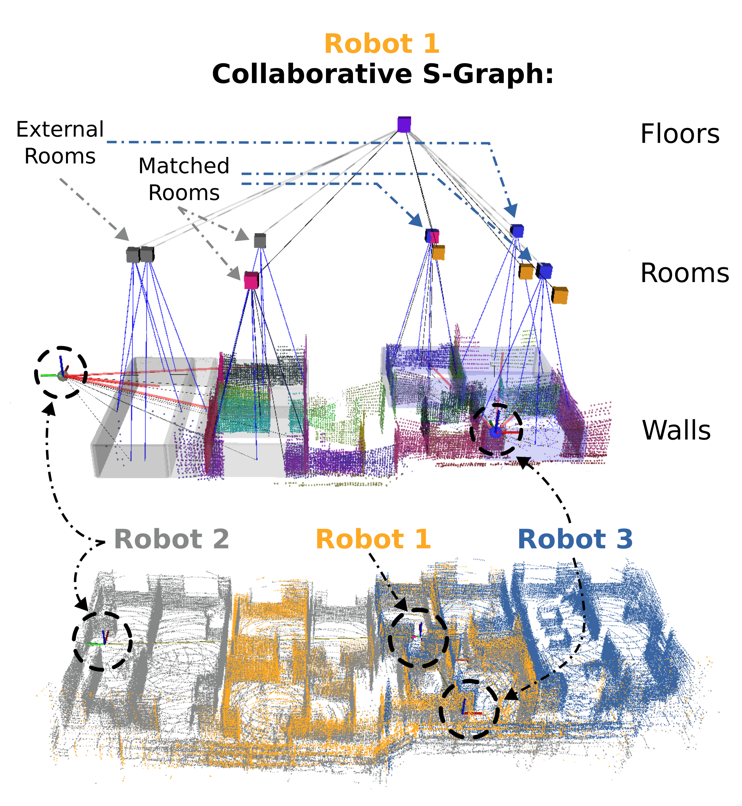

[](http://hits.dwyl.com/snt-arg/multi_s_graphs_docker)

<p align="center">
  <h1 align="center">Multi S-Graphs: an Efficient Real-time Distributed Semantic-Relational Collaborative SLAM</h1>
    <p align="center">
    <a href="https://scholar.google.com/citations?user=zKbiZzwAAAAJ&hl=es&oi=sra"><light>Miguel Fernandez Cortizas</light></a>
    ·
    <a href="http://hriday.bavle.com/"><light>Hriday Bavle</light></a>
    ·
    <a href="https://scholar.google.com/citations?user=Afdcjx4AAAAJ&hl=es&oi=ao"><light>David Perez-Saura</light></a>
    <br>
    <a href="https://wwwen.uni.lu/snt/people/jose_luis_sanchez_lopez"><light>Jose Luis Sanchez-Lopez</light></a>
    ·
    <a href="https://scholar.google.com/citations?user=apPMLQ4AAAAJ&hl=es&oi=ao"><light>Pascual Campoy</light></a>
    ·
    <a href="https://wwwen.uni.lu/studies/fstm/interdisciplinary_space_master/holger_voos"><light>Holger Voos</light></a>
  </p>

  <h3 align="center"><a href="https://arxiv.org/abs/2401.05152">Paper</a> | <a href="https://vimeo.com/cvarupm/multi-s-graphs?share=copy">Video</a></h3>
  
</p>

<br>

<p align="center">
  <a href="">
    
  </a>
</p>

## [TABLE OF CONTENTS](#table-of-contents)
- [Published Papers](#published-papers)
- [Getting started](#getting-started)
- [About Multi S-Graphs](#about-multi-s-graphs)
  - [Architecture](#architecture)
- [Example on Datasets](#example-on-datasets)
  - [Download Datasets](#download-datasets)
  - [Run Multi S-Graphs](#run-multi-s-graphs)
- [Configuration](#configuration)
- [ROS 2 Related](#ros-2-related)
  - [Relevant topics description](#relevant-topics-description)
- [License](#license)
- [Maintainers](#maintainers)


## Published Papers

<p align="center">
  <a href="https://vimeo.com/cvarupm/multi-s-graphs?share=copy">
    
  </a>
</p>

1. [Multi S-graphs: A Collaborative Semantic SLAM architecture
   ](https://arxiv.org/abs/2305.03441)
   - **Citation**
     ```latex
      @misc{fern2023multi,
        title={Multi S-graphs: A Collaborative Semantic SLAM architecture},
        author={Miguel Fernandez-Cortizas and Hriday Bavle and Jose Luis Sanchez-Lopez and Pascual Campoy and Holger Voos},
        year={2023},
        eprint={2305.03441},
        archivePrefix={arXiv},
        primaryClass={cs.RO}
      }
     ``` 

2. [S-Graphs+: Real-time Localization and Mapping leveraging
Hierarchical Representations
   ](https://arxiv.org/abs/2212.11770)
   - **Citation**
     ```latex
      @misc{bavle2022sgraphs+,
        title = {S-Graphs+: Real-time Localization and Mapping leveraging Hierarchical Representations},
        author={Hriday Bavle and Jose Luis Sanchez-Lopez and Muhammad Shaheer and Javier Civera and Holger Voos},
        year={2022},
        publisher = {arXiv},
        year = {2022},
        primaryClass={cs.RO}
     }
     ``` 

2. [Situational Graphs for Robot Navigation in Structured Indoor Environments
   ](https://arxiv.org/abs/2202.12197)
   - **Citation**
     ```latex
      @ARTICLE{9826367,
        author={Bavle, Hriday and Sanchez-Lopez, Jose Luis and Shaheer, Muhammad and Civera, Javier and Voos, Holger},
        journal={IEEE Robotics and Automation Letters}, 
        title={Situational Graphs for Robot Navigation in Structured Indoor Environments}, 
        year={2022},
        volume={7},
        number={4},
        pages={9107-9114},
        doi={10.1109/LRA.2022.3189785}}
     ```

## Getting started

1. Clone this repository

2. Pull the docker image from DockerHub

```sh
docker pull sntarg/multi_s_graphs:latest
```
3. Allow multicast for Zenoh and display access for visualization
```sh
sudo ifconfig lo multicast
xhost +
```
4. Modify the `path/to/rosbags/folder` inside the docker-compose.yml file. 
5. Compose a container from image using the docker-compose.yml configuration.
```sh
cd [/path/to/repository/folder]
docker compose up -d
```
This command also incorporates the flags `d`, which makes the container run in the detached mode

6. Open a terminal inside the container
```sh
docker exec -ti ms_graphs bash
```
7. Execute an instance of Multi S-Graphs
```sh
./tmux_launch.bash [robot_namespace] [path/to/robot/rosbag]
```

## About Multi S-Graphs

### Architecture

<p align="center">
<a href="">

</a>
</p>

## Example on Datasets

**Note:** For each command below, please execute them in separate terminal windows!

### Download Datasets

[Real Dataset](https://upm365-my.sharepoint.com/:f:/g/personal/miguel_fernandez_cortizas_upm_es/EiofGJrLFVxIvspsvCHrkG8ByT3ApBX6m_FQGgt3fQ_Oqg?e=jds3JD)

[Virtual Dataset](https://upm365-my.sharepoint.com/:f:/g/personal/miguel_fernandez_cortizas_upm_es/EqQycwb5Fs1GtaHAebWpe7gB-ytzSF7K0ATQIGjzs4E2nQ?e=TtqpsI)

### Run Multi S-Graphs
1. Open a terminal inside the container
```sh
docker exec -ti ms_graphs bash
```
2. In this terminal inside the container, execute an instance of Multi S-Graphs for Robot1
```sh
./tmux_launch.bash robot1 rosbags/?_split_robot1.bag
```
3. In a different window, open another terminal inside the container
```sh
docker exec -ti ms_graphs bash
```
4. In this terminal inside the container, execute an instance of Multi S-Graphs for Robot2
```sh
./tmux_launch.bash robot1 rosbags/?_split_robot2.bag
```

## Configuration
The configuration of each robot is the same than described in [S-Graphs+](https://github.com/snt-arg/s_graphs_docker).

## ROS 2 Related

The ROS 2 RMW that we use is CycloneDDS as we rely on the Zenoh ROS2 bridges for connecting multiple robots between them.
Please check that your ROS 2 system is using this RMW if you want to inspect the execution nodes.

In our system we use a different ```ROS_DOMAIN_ID``` environment variable for each robot. The ID matches with the robot number e.g. robot1 has ```ROS_DOMAIN_ID=1```.
In order to inspect the different nodes and topic please set your terminal into a corresponding ```ROS_DOMAIN_ID``` with:

```sh
export ROS_DOMAIN_ID=<YOUR_DESIRED_ID>
```

### Relevant topics description

Input topics for each robot are the same than described in [S-Graphs+](https://github.com/snt-arg/s_graphs_docker) with the appropiate namespaces. 

Multi S-Graphs shared topics between agents:
  - `/graph_room_keyframes_all` [graph_manager_msgs/msg/RoomKeyframe]
    - Shared Room Descriptors between agents.
  - `/graph_vertical_planes_all` [graph_manager_msgs/msg/VerticalPlanes]
    - Shared Vertical Planes between agents. 
  - `/relative_map_estimation` [graph_manager_msgs/msg/RelativeMapEstimation]
    - Tranformations between every agent map frame.

Visualization topics for each robot:
  - `/[robot_namespace]/s_graphs/markers` [visualization_msgs/msg/MarkerArray]
    - Visualization of the Situational Graph
  - `/[robot_namespace]/s_graphs/map_points_ts` [sensor_msgs/msg/PointCloud2]
    - Visualization of the Point Cloud
  - `/[robot_namespace]/s_graphs/pose_ts` [geometry_msgs/msg/PoseStamped]
    - Visualization of the Pose


## License

This package is released under the **BSD-2-Clause** License.

Note that the cholmod solver in g2o is licensed under GPL. You may need to build g2o without cholmod dependency to avoid the GPL.

## Maintainers

- <ins>**Miguel Fernandez-Cortizas**</ins>
  - **Email:** miguel.fernandez.cortizas@upm.es
- <ins>**Hriday Bavle**</ins>
  - **Email:** hriday.bavle@uni.lu
  - **Website:** https://www.hriday.bavle.com/
- <ins>**David Perez-Saura**</ins>
  - **Email:** david.perez.saura@upm.es

<br/>
<br/>
<p align="center">
  <a href="">
    
  </a>
</p>
